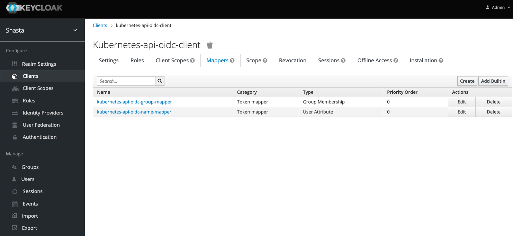
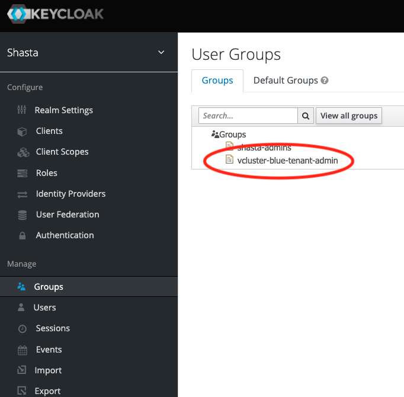
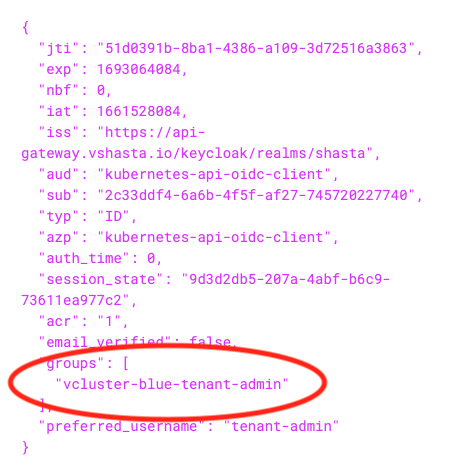

# Tenant Administrator Configuration

This page will describe how to configure a user as a `Tenant Administrator`, allowing that person to perform administrative functions on one or more tenants, without giving them the same permissions an `Infrastructure Administrator` would have.

## Table of Contents

- [Tenant Administrator Configuration](#tenant-administrator-configuration)
  - [Table of Contents](#table-of-contents)
  - [Kubernetes OIDC API Integration](#kubernetes-oidc-api-integration)
  - [Tenant Specific Keycloak Groups](#tenant-specific-keycloak-groups)
  - [Roles and Rolebindings](#roles-and-rolebindings)
  - [Retrieve an OIDC Token](#retrieve-an-oidc-token)
  - [Using kubelogin](#using-kubelogin)

## Kubernetes OIDC API Integration

When CSM 1.3 is installed, the Keycloak Helm chart will run a setup script which creates a Keycloak client for OIDC integration.  This is visible in the Keycloak UI (see below).  This client has two mappers which will add the user name and group(s) to an OIDC token generated by Keycloak:



The Kubernetes API server is then configured to reference this client for token and user/group claim validation:

```bash
    - --oidc-ca-file=/etc/kubernetes/pki/oidc.pem
    - --oidc-client-id=kubernetes-api-oidc-client
    - --oidc-groups-claim=groups
    - --oidc-issuer-url=https://api-gateway.vshasta.io/keycloak/realms/shasta
    - --oidc-username-claim=name
```

## Tenant Specific Keycloak Groups

When a tenant is created, `tapms` will create a Keycloak group specific for that tenant.  In the below example, `vcluster-blue` is the name of the tenant, and `tapms` has created a group with the name `vcluster-blue-tenant-admin`:



For the initial release of multi-tenancy assiging this group to a user is a manual process.  Select the desired user and add them as a member of the new group as follows:


Users can be added to more than one tenant using the same procedure.

## Roles and Rolebindings

Ultimately, the operations the tenant administrator is authorized to perform are controlled by [Kubernetes RBAC](https://kubernetes.io/docs/reference/access-authn-authz/rbac/). By default when a tenant is created and a Keycloak user is added to a tenant's Keycloak Group, that user will have no permissions configured.  The `Infrastructure Administrator` needs to create the desired/appropriate `Roles` and `RoleBindings` for the tenant administrator.  Below is an example of a yaml file which will give the given user some basic permissions for both the `tenants` and `vcluster-blue` namespaces:

```bash
kind: ClusterRole
apiVersion: rbac.authorization.k8s.io/v1beta1
metadata:
  name: tenant-admin-role
rules:
  - apiGroups: [""]
    resources: ["secrets", "namespaces","pods"]
    verbs: ["get", "watch", "list"]
  - apiGroups: ["tapms.hpe.com"]
    resources: ["tenants"]
    verbs: ["patch", "get", "watch", "list"]
---
kind: RoleBinding
apiVersion: rbac.authorization.k8s.io/v1beta1
metadata:
  name: tenant-admin-rb-blue
  namespace: vcluster-blue
roleRef:
  apiGroup: rbac.authorization.k8s.io
  kind: ClusterRole
  name: tenant-admin-role
subjects:
- kind: Group
  name: "vcluster-blue-tenant-admin"
  apiGroup: rbac.authorization.k8s.io
---
kind: RoleBinding
apiVersion: rbac.authorization.k8s.io/v1beta1
metadata:
  name: tenant-admin-tenants-blue-rb
  namespace: tenants
roleRef:
  apiGroup: rbac.authorization.k8s.io
  kind: ClusterRole
  name: tenant-admin-role
subjects:
- kind: Group
  name: "vcluster-blue-tenant-admin"
  apiGroup: rbac.authorization.k8s.io
```

Note the reference to the Keycloak group `vcluster-blue-tenant-admin` in each of the `RoleBinding` sections.  Adminstrators can create the appropriate `rules` in the `ClusterRole` which control the actions the tenant administrator is allowed to perform.

## Retrieve an OIDC Token

The following command is an example of how to retrieve an OIDC token for interacting directly with the Kubernetes API:

```bash
TOKEN=$(curl -k -s -d scope=openid -d response_type=id_token -d grant_type=password -d client_id=kubernetes-api-oidc-client -d password=initial0 -d username=tenant-admin https://api-gateway.vshasta.io/keycloak/realms/shasta/protocol/openid-connect/token | jq -r '.id_token')
```

Decoding this token will illustrate the group `claim` added by Keycloak:



This token can now be used by a the tenant adminstrator to interact with Kubernetes:

## Using kubelogin

CSM deploys a `kubelogin` plugin on NCNs as well as a sample `tenant-admin.conf` file, which will allow tenant administrators to login and perform operations using `kubectl`:
